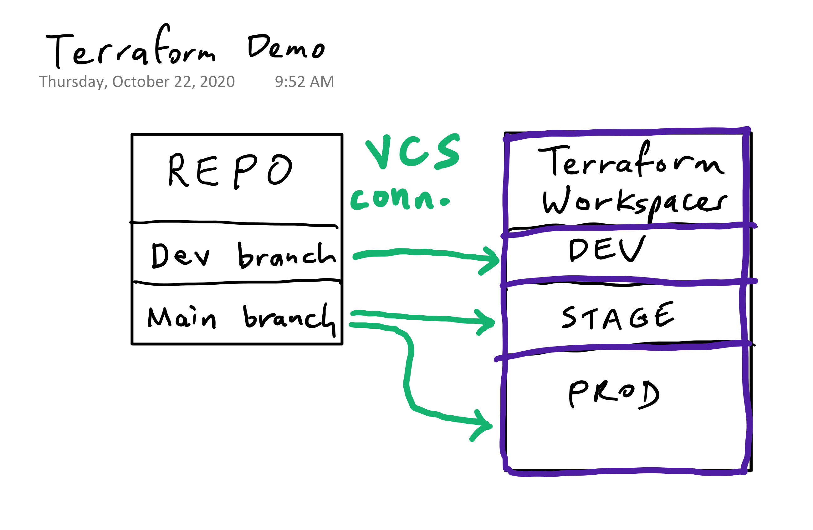

# terraform-demo-vmware

## Prerequisites
1. Workspaces created and VCS connections in place on workspaces as follows:

*Test workspace for CLI driven flow with remote backend is optional.*
2. Make sure tfc-agent(s) are running as appropriate.
3. Make sure main.tf is blank in dev and main branches.
4. Open incognito browser window and sign in to GitHub as developer user.
5. Open browser window signed in to Terraform Cloud as myself.

## Demo Script
1. old way (google it) vs new way (developer goes to PMR) -- sign in as dev using okta SSO
2. select module
3. go to github and show bare repo (this can be auto generated, repo, workspace as a service. put short lived creds in here as well)
4. edit main.tf 9 lines and boom, commit to dev. [VCS driven] "this is important because it enables me to map from the changes in git to how it will impact my real life infra"
5. while it’s provisioning show:
* workspaces
* run history
* state history + diffs
* variables
* RBAC
6. now open PR, show speculative plan
7. show and explain sentinel policy as code
8. merge PR, show plans queued in both stage and prod
9. review and apply stage, then later review and apply prod
9. destroy from GUI (API script if needed is `~/Developer/destroy.sh hashidemos a-tf-demo-vmware-TEST`)

## Completed Code
```
module "virtual-machine" {
  source  = "app.terraform.io/hashidemos/virtual-machine/vsphere"
  version = "0.1.2"

  app_name    = "ninjas-skunkworks-nginx"
  description = "a skunkworks project"
  environment = var.environment
  owner       = "008103"

  num_cpus  = "2"
  memory    = "2048"
  disk_size = "20"
}

variable "environment" {}

output "name" { value = module.virtual-machine.name }
output "ssh_ip" { value = module.virtual-machine.ssh_addr }
```

## Futures
develop a script to create workspaces
* name-testing
* name-staging
* name-production
* set workspace specific variables (environment)
* set execution mode to agent (maybe)
* connect VCS for staging and prod
* generate remote_backend.tf files
* apply sentinel policies
